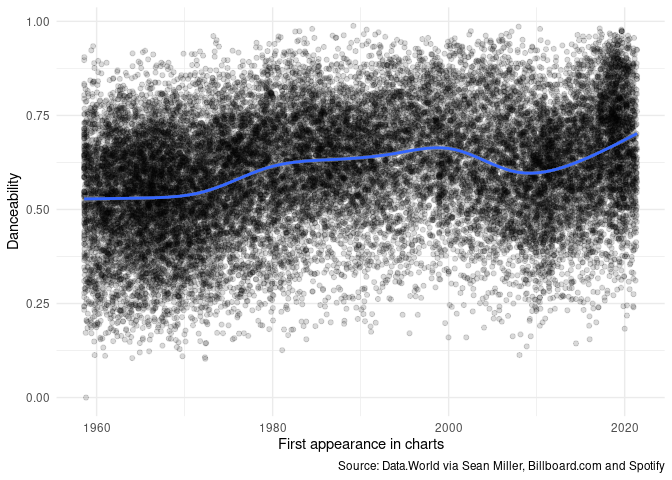
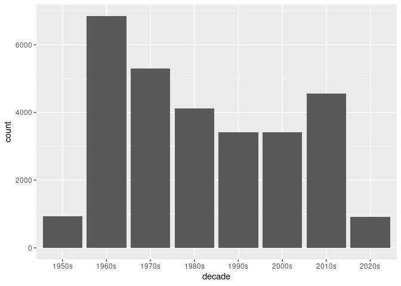
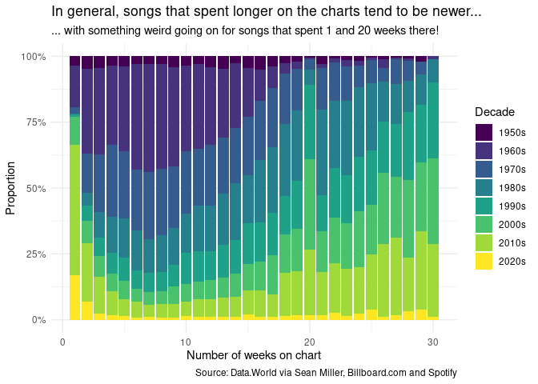

Code-along, Week 02: *Billboard* Hot 100
================
Alex Homer
30 September 2021

``` r
library(tidyverse)
library(scales)
library(lubridate)
library(emo)
#To install the "emo" package run:
# devtools::install_github("hadley/emo")
#You may need to install the "devtools" package first, in the normal way.
```

## Read data

The data are drawn from the “Tidy Tuesday” project: [2021 Week 38: Top
100
Billboard](https://github.com/rfordatascience/tidytuesday/blob/master/data/2021/2021-09-14/readme.md)
(credit:
[Data.World](https://data.world/kcmillersean/billboard-hot-100-1958-2017#),
via Sean Miller, [Billboard.com](https://www.billboard.com/) and
Spotify). We have very lightly modified the data by converting the
`week_id` column to a week that R can recognise.

``` r
chart_data <- readRDS("data/billboard.rds")
chart_data %>%
  summarise(
    first_week = min(chart_date),
    last_week = max(chart_date)
  )
```

    ## # A tibble: 1 x 2
    ##   first_week last_week 
    ##   <date>     <date>    
    ## 1 1958-08-02 2021-05-29

The data span from 2nd August 1958 (which according to
[Wikipedia](https://en.wikipedia.org/wiki/Billboard_Hot_100#History) was
the first *Billboard* Hot 100 chart, although Wikipedia has the date a
couple of days later) to 29th May 2021.

The full dataset has a row (i.e. an observation) for every week and
chart position, so any song that was on the charts for more than one
week appears multiple times. For example, if we take [one particular
song](https://www.youtube.com/watch?v=dQw4w9WgXcQ)…

``` r
never_gonna <- chart_data %>%
  filter(song == "Never Gonna Give You Up") %>%
  arrange(chart_date) %>%
  select(song, performer, chart_date, week_position)

never_gonna %>% print(n = dim(never_gonna)[1]) #Print all rows
```

    ## # A tibble: 24 x 4
    ##    song                    performer   chart_date week_position
    ##    <chr>                   <chr>       <date>             <dbl>
    ##  1 Never Gonna Give You Up Rick Astley 1987-12-19            71
    ##  2 Never Gonna Give You Up Rick Astley 1987-12-26            61
    ##  3 Never Gonna Give You Up Rick Astley 1988-01-02            61
    ##  4 Never Gonna Give You Up Rick Astley 1988-01-09            52
    ##  5 Never Gonna Give You Up Rick Astley 1988-01-16            41
    ##  6 Never Gonna Give You Up Rick Astley 1988-01-23            34
    ##  7 Never Gonna Give You Up Rick Astley 1988-01-30            24
    ##  8 Never Gonna Give You Up Rick Astley 1988-02-06            16
    ##  9 Never Gonna Give You Up Rick Astley 1988-02-13            11
    ## 10 Never Gonna Give You Up Rick Astley 1988-02-20             8
    ## 11 Never Gonna Give You Up Rick Astley 1988-02-27             4
    ## 12 Never Gonna Give You Up Rick Astley 1988-03-05             2
    ## 13 Never Gonna Give You Up Rick Astley 1988-03-12             1
    ## 14 Never Gonna Give You Up Rick Astley 1988-03-19             1
    ## 15 Never Gonna Give You Up Rick Astley 1988-03-26             3
    ## 16 Never Gonna Give You Up Rick Astley 1988-04-02             8
    ## 17 Never Gonna Give You Up Rick Astley 1988-04-09            18
    ## 18 Never Gonna Give You Up Rick Astley 1988-04-16            25
    ## 19 Never Gonna Give You Up Rick Astley 1988-04-23            35
    ## 20 Never Gonna Give You Up Rick Astley 1988-04-30            50
    ## 21 Never Gonna Give You Up Rick Astley 1988-05-07            62
    ## 22 Never Gonna Give You Up Rick Astley 1988-05-14            68
    ## 23 Never Gonna Give You Up Rick Astley 1988-05-21            72
    ## 24 Never Gonna Give You Up Rick Astley 1988-05-28            91

… we see that it was on the chart for many weeks. This allows us to plot
the chart fortunes of this song:

``` r
never_gonna %>% ggplot(aes(x = chart_date, y = week_position)) +
  geom_line() +
  scale_x_date(
    labels = date_format("%d %b %Y"),
    expand = expansion(0.05, c(0,10))
  ) +
  scale_y_reverse(breaks = c(1, 10*(1:10))) + #Lower number = higher chart position
  labs(
    x = "Date",
    y = "Chart position",
    title = "I just wanna tell you how I'm charting",
    subtitle = "Gotta make you understand",
    caption = "Source: Data.World via Sean Miller, Billboard.com and Spotify"
  ) +
  coord_cartesian(ylim = c(100, 1)) +
  theme_minimal() +
  theme(panel.grid.minor = element_blank())
```

<!-- -->

Let’s try a different song.

``` r
chart_data %>% filter(song == "Counting Stars") %>%
  ggplot(aes(x = chart_date, y = week_position)) +
  geom_line() +
  scale_y_reverse()
```

<!-- -->

💡 *This code chunk shows what we wrote during the live code-along.
Compare the output of this code to the output of the code above; see if
you can deduce what the extra lines in the first version do.* 💡

Anyway, this is probably a bit “too much data” for our purposes in this
code-along, so I’ve summarised the data so that each song appears only
once, with some useful statistics for each song. I’ve then put the
results in a new .rds file, which we now import.

``` r
song_data <- readRDS("data/songs.rds")
```

## Danceability

The data contain a score for “danceability” of the songs. We can use
this to find the most danceable songs…

``` r
song_data %>% arrange(desc(danceability)) %>%
  select(song, performer, danceability)
```

    ## # A tibble: 29,506 x 3
    ##    song                             performer                       danceability
    ##    <chr>                            <chr>                                  <dbl>
    ##  1 Funky Cold Medina                Tone-Loc                               0.988
    ##  2 Go Girl                          Pitbull Featuring Trina & Youn~        0.986
    ##  3 Cash Me Outside (#CashMeOutside) DJ Suede The Remix God                 0.981
    ##  4 Ice Ice Baby                     Glee Cast                              0.98 
    ##  5 State of Shock                   The Jacksons                           0.98 
    ##  6 Ice Ice Baby                     Vanilla Ice                            0.978
    ##  7 Uno                              Ambjaay                                0.978
    ##  8 Bad Bad Bad                      Young Thug Featuring Lil Baby          0.974
    ##  9 Bad Bad Bad                      Young Thug Featuring Lil Baby          0.974
    ## 10 Betcha She Don't Love You        Evelyn King                            0.974
    ## # ... with 29,496 more rows

… as well as the least.

``` r
song_data %>% arrange(danceability) %>%
  select(song, performer, danceability)
```

    ## # A tibble: 29,506 x 3
    ##    song                               performer           danceability
    ##    <chr>                              <chr>                      <dbl>
    ##  1 A Letter To An Angel               Jimmy Clanton              0    
    ##  2 An American Trilogy                Elvis Presley              0.103
    ##  3 Charade                            Andy Williams              0.105
    ##  4 Isn't Life Strange                 The Moody Blues            0.107
    ##  5 You'll Never Walk Alone            The Brooklyn Bridge        0.11 
    ##  6 Silent Night                       Bing Crosby                0.111
    ##  7 The Story Of Our Love              Johnny Mathis              0.113
    ##  8 Through The Fire And Flames        DragonForce                0.113
    ##  9 Walk Away                          Matt Monro                 0.12 
    ## 10 On A Clear Day You Can See Forever Johnny Mathis              0.123
    ## # ... with 29,496 more rows

I suspect that there’s been some sort of data problem with the least
danceable song, given that it has a score of exactly 0 (and if you
[listen to it](https://www.youtube.com/watch?v=BQncPrWaxgI) it certainly
doesn’t seem like an extremely un-danceable song. Let’s investigate by
looking at its values for some of the other scores.

``` r
song_data %>% filter(song == "A Letter To An Angel") %>%
  select(energy, acousticness, speechiness, liveness)
```

    ## # A tibble: 1 x 4
    ##   energy acousticness speechiness liveness
    ##    <dbl>        <dbl>       <dbl>    <dbl>
    ## 1  0.287        0.876           0    0.112

Maybe that is the real value, then? Certainly “real data” seem to appear
for the other values. But if we do exclude it, then the least danceable
song is “[An American
Trilogy](https://www.youtube.com/watch?v=dQw4w9WgXcQ)” by Elvis Presley.

We should take this with a pinch of salt, though, because not all songs
had a danceability value.

``` r
song_data %>%
  summarise(dance_val_prop = sum(is.na(danceability))/n())
```

    ## # A tibble: 1 x 1
    ##   dance_val_prop
    ##            <dbl>
    ## 1          0.175

17.5% didn’t, in fact.

What if we look at the average danceability by year? First we need a
“year” variable (we’ll take the year a song first entered the charts as
its “year”, since we don’t have data on release dates).

``` r
song_data <- song_data %>%
  mutate(song_year = year(first_appearance))

song_data %>%
  group_by(song_year) %>%
  summarise(average_dance = mean(danceability, na.rm = TRUE)) %>%
  ggplot(aes(x = song_year, y = average_dance)) +
  geom_line() +
  theme_minimal() +
  labs(
    x = "Year",
    y = "Average danceability of songs",
    title = "Danceability seems to be weakly increasing",
    caption = "Source: Data.World via Sean Miller, Billboard.com and Spotify"
  )
```

<!-- -->

There seems to be a dip in danceability centered on around 2010. If we
look at the least danceable songs, it’s easy to blame this on one
particular TV show…

``` r
song_data %>% filter(song_year == 2010) %>%
  arrange(danceability) %>%
  select(song, performer, danceability)
```

    ## # A tibble: 474 x 3
    ##    song                                             performer       danceability
    ##    <chr>                                            <chr>                  <dbl>
    ##  1 New Morning                                      Alpha Rev              0.191
    ##  2 Black Rain                                       Soundgarden            0.2  
    ##  3 Don't Cry For Me Argentina (Lea Michele Version) Glee Cast              0.21 
    ##  4 I Dreamed A Dream                                Glee Cast Feat~        0.236
    ##  5 Beautiful                                        Glee Cast              0.253
    ##  6 Hallelujah (Vancouver Winter 2010 Version)       k.d. lang              0.256
    ##  7 A House Is Not A Home                            Glee Cast              0.266
    ##  8 One Less Bell To Answer / A House Is Not A Home  Glee Cast Feat~        0.266
    ##  9 One Of Us                                        Glee Cast              0.278
    ## 10 What I Did For Love                              Glee Cast              0.281
    ## # ... with 464 more rows

… but the *Glee* cast appear heavily in the most danceable songs too,
including the most danceable, so that’s probably unfair.

``` r
song_data %>% filter(song_year == 2010) %>%
  arrange(desc(danceability)) %>%
  select(song, performer, danceability)
```

    ## # A tibble: 474 x 3
    ##    song                       performer               danceability
    ##    <chr>                      <chr>                          <dbl>
    ##  1 Ice Ice Baby               Glee Cast                      0.98 
    ##  2 Another One Bites The Dust Glee Cast                      0.95 
    ##  3 Take It Off                Ke$ha                          0.923
    ##  4 I'm A Slave 4 U            Glee Cast                      0.909
    ##  5 We No Speak Americano      Yolanda Be Cool & Dcup         0.902
    ##  6 Your Love Is My Drug       Ke$ha                          0.902
    ##  7 Lover, Lover               Jerrod Niemann                 0.879
    ##  8 Outta Your Mind            Lil Jon Featuring LMFAO        0.876
    ##  9 Not Afraid                 Eminem                         0.855
    ## 10 Check It Out               will.i.am & Nicki Minaj        0.854
    ## # ... with 464 more rows

Instead of doing the average, let’s do a scatter plot of all songs’
danceability against their first appearance in the chart.

``` r
song_data %>%
  ggplot(aes(x = first_appearance, y = danceability)) +
  geom_point(alpha = 0.15) + #So we can see all the points
  labs(
    x = "First appearance in charts",
    y = "Danceability",
    caption = "Source: Data.World via Sean Miller, Billboard.com and Spotify",
  ) +
  geom_smooth() + #Trend line
  theme_minimal()
```

<!-- -->

Suddenly the 2010 dip is a lot less pronounced! Although it still shows
up in the trend line.

## Weeks on the chart

Let’s go a little bit further than the year split, and assign each song
to the decade in which it first appeared on the chart.

``` r
song_data <- song_data %>%
  mutate(
    decade = cut(
      first_appearance,
      breaks = seq.Date(
        from = as.Date("1950/01/01"),
        to = as.Date("2030/01/01"),
        by = "10 years"
      ),
      labels = c("1950s", "1960s", "1970s", "1980s", "1990s",
                 "2000s", "2010s", "2020s"),
      right = FALSE
    )
  )
```

We can then count the number of songs that charted in each decade.

``` r
count(song_data, decade)
```

    ## # A tibble: 8 x 2
    ##   decade     n
    ##   <fct>  <int>
    ## 1 1950s    926
    ## 2 1960s   6852
    ## 3 1970s   5299
    ## 4 1980s   4114
    ## 5 1990s   3423
    ## 6 2000s   3419
    ## 7 2010s   4556
    ## 8 2020s    917

``` r
#We could write this as
# song_data %>% count(decade)
#but it's a bit pointless using the pipe when there's only one step
```

Unsurprisingly there are fewer songs from the 1950s (because the chart
started in 1958) and from the 2020s (because they haven’t finished yet).
One thing that’s noticeable, though, is that there were a lot more songs
in the 1960s. We can visualise that using a bar chart.

``` r
song_data %>% ggplot(aes(x = decade)) +
  geom_bar()
```

<!-- -->

For each decade, we can plot a histogram of the number of weeks songs
spent on the chart. [1] We do this using faceting.

``` r
song_data %>% ggplot(aes(x = weeks_on_chart)) +
  facet_wrap(~decade) +
  geom_histogram(breaks = 3*(0:29 + 0.5)) #Each block is three years
```

<!-- -->

💡 *How could we make either of these plots prettier?* 💡

Two things are evident here:

-   Firstly, songs are tending to spend longer on the charts as the
    decades go on—although from the 2000s onwards the number of songs
    spending extremely short amounts of time on the chart increases.
-   Secondly, there’s a strange peak at around 20 weeks, where we
    suddenly get lots of songs having that length of time on the charts.
    This only appears from the 1990s.

You can see both features in the following graph, where, for each
possible number of weeks spent on the chart from 1 to 30, we show what
proportion of such songs spent exactly that number of weeks on the
chart.

``` r
song_data %>% filter(weeks_on_chart <= 30) %>%
  ggplot(aes(x = weeks_on_chart, fill = decade)) +
  geom_bar(position = "fill") +
  scale_fill_viridis_d() +
  scale_y_continuous(labels = scales::percent) +
  labs(
    x = "Number of weeks on chart",
    y = "Proportion",
    fill = "Decade",
    caption = "Source: Data.World via Sean Miller, Billboard.com and Spotify",
    title = "In general, songs that spent longer on the charts tend to be newer...",
    subtitle = "... with something weird going on for songs that spent 1 and 20 weeks there!"
  ) +
  theme_minimal()
```

<!-- -->

💡 *The data aren’t really all that valid for songs that are still on the
charts, because they haven’t really dropped off the charts yet. This
will affect 100 songs in the 2020s section. What could we do about that?
Does it matter?* 💡

The trends are pretty appearent here: if the song spent longer on the
charts, it’s more likely to be newer. But what’s going on at 1 and 20
weeks?

For the very short numbers of weeks, notice that a majority of songs
that have spent exactly one week on the charts are from the 2010s or
later, with also far more in the 2000s than in the 1990s or 1980s. What
changed about singles in that period? Well, *Billboard* [started
tracking
downloads](https://en.wikipedia.org/wiki/Billboard_Hot_100#Digital_downloads,_online_streaming_and_bundles)
for the Hot 100 in 2005. Downloads (and now streaming, included since
2007) can create more volatile swings for songs, because there doesn’t
need to be a physical shipment of 45s/cassettes/CDs to make a song enter
the charts.

The coloured bar graph makes it clear that the weird behaviour at 20
weeks affects particularly the data for songs spending *exactly* 20
weeks on the chart, and the histograms suggest that this started in the
1990s. Such a sharp peak is unlikely to be the result of natural
purchasing/streaming habits. In fact, it can be explained by a
[different policy
change](https://en.wikipedia.org/wiki/Billboard_Hot_100#Recurrents) on
the part of *Billboard*: “if a song has spent 20 weeks on the Hot 100
and fallen below position number 50”, it is given “recurrent status”,
and removed from the chart. [2] It’s quite neat, I think, that we can
see this clearly reflected in the data!

[1] This is the total number of weeks, so for *any* song this could
still increase if the song re-entered the chart. The original data
accounted for this by assigning “instances” for every time a song
re-entered the charts: perhaps we should have grouped by each song *and
instance*, rather than just each song?

[2] Source of quote:
[Wikipedia](https://en.wikipedia.org/wiki/Billboard_Hot_100#Recurrents).
