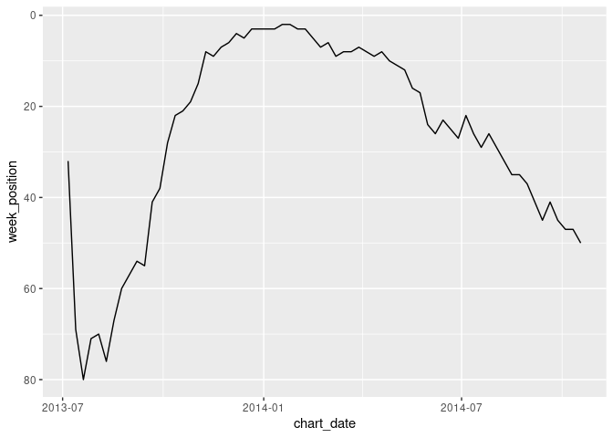
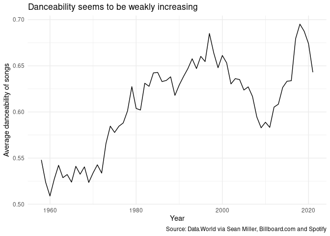

Code-along, Week 02: Billboard Hot 100
================
Alex Homer
23 September 2021

``` r
library(tidyverse)
library(scales)
library(lubridate)
```

## Read data

The data are drawn from the “Tidy Tuesday” project: [2021 Week 38: Top
100
Billboard](https://github.com/rfordatascience/tidytuesday/blob/master/data/2021/2021-09-14/readme.md)
(credit:
[Data.World](https://data.world/kcmillersean/billboard-hot-100-1958-2017#),
via Sean Miller, [Billboard.com](https://www.billboard.com/) and
Spotify). We have very lightly modified the data by converting the
`week_id` column to a week that R can recognise.

``` r
chart_data <- readRDS("data/billboard.rds")
chart_data %>%
  summarise(
    first_week = min(chart_date),
    last_week = max(chart_date)
  )
```

    ## # A tibble: 1 x 2
    ##   first_week last_week 
    ##   <date>     <date>    
    ## 1 1958-08-02 2021-05-29

The data span from 2nd August 1958 (which according to
[Wikipedia](https://en.wikipedia.org/wiki/Billboard_Hot_100#History) was
the first Hot 100 chart, although Wikipedia has the date a couple of
days later) to 29th May 2021.

The full dataset has a row (i.e. an observation) for every week and
chart position, so any song that was on the charts for more than one
week appears multiple times. For example, if we take [one particular
song](https://www.youtube.com/watch?v=dQw4w9WgXcQ)…

``` r
never_gonna <- chart_data %>%
  filter(song == "Never Gonna Give You Up") %>%
  arrange(chart_date) %>%
  select(song, performer, chart_date, week_position)

never_gonna %>% print(n = dim(never_gonna)[1]) #Print all rows
```

    ## # A tibble: 24 x 4
    ##    song                    performer   chart_date week_position
    ##    <chr>                   <chr>       <date>             <dbl>
    ##  1 Never Gonna Give You Up Rick Astley 1987-12-19            71
    ##  2 Never Gonna Give You Up Rick Astley 1987-12-26            61
    ##  3 Never Gonna Give You Up Rick Astley 1988-01-02            61
    ##  4 Never Gonna Give You Up Rick Astley 1988-01-09            52
    ##  5 Never Gonna Give You Up Rick Astley 1988-01-16            41
    ##  6 Never Gonna Give You Up Rick Astley 1988-01-23            34
    ##  7 Never Gonna Give You Up Rick Astley 1988-01-30            24
    ##  8 Never Gonna Give You Up Rick Astley 1988-02-06            16
    ##  9 Never Gonna Give You Up Rick Astley 1988-02-13            11
    ## 10 Never Gonna Give You Up Rick Astley 1988-02-20             8
    ## 11 Never Gonna Give You Up Rick Astley 1988-02-27             4
    ## 12 Never Gonna Give You Up Rick Astley 1988-03-05             2
    ## 13 Never Gonna Give You Up Rick Astley 1988-03-12             1
    ## 14 Never Gonna Give You Up Rick Astley 1988-03-19             1
    ## 15 Never Gonna Give You Up Rick Astley 1988-03-26             3
    ## 16 Never Gonna Give You Up Rick Astley 1988-04-02             8
    ## 17 Never Gonna Give You Up Rick Astley 1988-04-09            18
    ## 18 Never Gonna Give You Up Rick Astley 1988-04-16            25
    ## 19 Never Gonna Give You Up Rick Astley 1988-04-23            35
    ## 20 Never Gonna Give You Up Rick Astley 1988-04-30            50
    ## 21 Never Gonna Give You Up Rick Astley 1988-05-07            62
    ## 22 Never Gonna Give You Up Rick Astley 1988-05-14            68
    ## 23 Never Gonna Give You Up Rick Astley 1988-05-21            72
    ## 24 Never Gonna Give You Up Rick Astley 1988-05-28            91

… we see that it was on the chart for many weeks. This allows us to plot
the chart fortunes of this song:

``` r
never_gonna %>% ggplot(aes(x = chart_date, y = week_position)) +
  geom_line() +
  scale_x_date(
    labels = date_format("%d %b %Y"),
    expand = expansion(0.05, c(0,10))
  ) +
  scale_y_reverse(breaks = c(1, 10*(1:10))) + #Lower number = higher chart position
  labs(
    x = "Date",
    y = "Chart position",
    title = "I just wanna tell you how I'm charting",
    subtitle = "Gotta make you understand",
    caption = "Source: Data.World via Sean Miller, Billboard.com and Spotify"
  ) +
  coord_cartesian(ylim = c(100, 1)) +
  theme_minimal() +
  theme(panel.grid.minor = element_blank())
```

<!-- -->

But this is probably a bit “too much data” for our purposes in this
code-along, so I’ve summarised the data so that each song appears only
once, with some useful statistics for each song. I’ve then put the
results in a new .rds file, which we now import.

``` r
song_data <- readRDS("data/songs.rds")
```

Let’s try a different song.

``` r
chart_data %>% filter(song == "Counting Stars") %>%
  ggplot(aes(x = chart_date, y = week_position)) +
  geom_line() +
  scale_y_reverse()
```

<!-- -->

## Songs

``` r
song_data %>% arrange(desc(danceability)) %>%
  select(song, performer, danceability)
```

    ## # A tibble: 29,506 x 3
    ##    song                             performer                       danceability
    ##    <chr>                            <chr>                                  <dbl>
    ##  1 Funky Cold Medina                Tone-Loc                               0.988
    ##  2 Go Girl                          Pitbull Featuring Trina & Youn~        0.986
    ##  3 Cash Me Outside (#CashMeOutside) DJ Suede The Remix God                 0.981
    ##  4 Ice Ice Baby                     Glee Cast                              0.98 
    ##  5 State of Shock                   The Jacksons                           0.98 
    ##  6 Ice Ice Baby                     Vanilla Ice                            0.978
    ##  7 Uno                              Ambjaay                                0.978
    ##  8 Bad Bad Bad                      Young Thug Featuring Lil Baby          0.974
    ##  9 Bad Bad Bad                      Young Thug Featuring Lil Baby          0.974
    ## 10 Betcha She Don't Love You        Evelyn King                            0.974
    ## # ... with 29,496 more rows

``` r
song_data <- song_data %>%
  mutate(song_year = year(first_appearance))

song_data %>%
  group_by(song_year) %>%
  summarise(average_dance = mean(danceability, na.rm = TRUE)) %>%
  ggplot(aes(x = song_year, y = average_dance)) +
  geom_line()
```

<!-- -->

``` r
song_data %>% filter(song_year == 2010) %>%
  arrange(danceability) %>%
  select(song, performer, danceability)
```

    ## # A tibble: 474 x 3
    ##    song                                             performer       danceability
    ##    <chr>                                            <chr>                  <dbl>
    ##  1 New Morning                                      Alpha Rev              0.191
    ##  2 Black Rain                                       Soundgarden            0.2  
    ##  3 Don't Cry For Me Argentina (Lea Michele Version) Glee Cast              0.21 
    ##  4 I Dreamed A Dream                                Glee Cast Feat~        0.236
    ##  5 Beautiful                                        Glee Cast              0.253
    ##  6 Hallelujah (Vancouver Winter 2010 Version)       k.d. lang              0.256
    ##  7 A House Is Not A Home                            Glee Cast              0.266
    ##  8 One Less Bell To Answer / A House Is Not A Home  Glee Cast Feat~        0.266
    ##  9 One Of Us                                        Glee Cast              0.278
    ## 10 What I Did For Love                              Glee Cast              0.281
    ## # ... with 464 more rows
